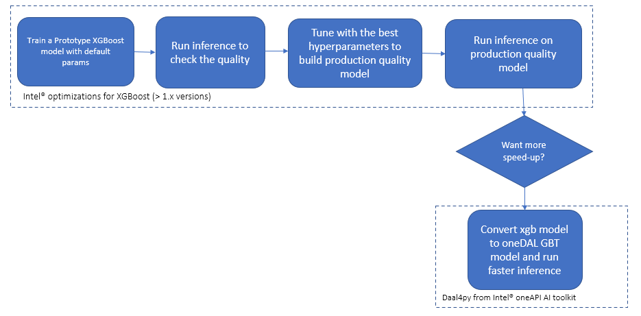

PROJECT NOT UNDER ACTIVE MANAGEMENT

This project will no longer be maintained by Intel.

Intel has ceased development and contributions including, but not limited to, maintenance, bug fixes, new releases, or updates, to this project.  

Intel no longer accepts patches to this project.

If you have an ongoing need to use this project, are interested in independently developing it, or would like to maintain patches for the open source software community, please create your own fork of this project.  

Contact: webadmin@linux.intel.com
# Predictive Asset Health Analytics

## Introduction
Create an end-to-end predictive asset maintenance solution to predict defects and anomalies before they happen with XGBoost* from [Intel® oneAPI AI Analytics Toolkit](https://www.intel.com/content/www/us/en/developer/tools/oneapi/ai-analytics-toolkit.html) (oneAPI). Check out more workflow examples in the [Developer Catalog](https://developer.intel.com/aireferenceimplementations).

## **Table of Contents**

- [Solution Technical Overview](#solution-technical-overview)
- [Validated Hardware Details](#validated-hardware-details)
- [How it Works?](#how-it-works)
- [Get Started](#get-started)
  - [Download the Workflow Repository](#download-the-workflow-repository)
  - [Set Up Conda](#set-up-conda)
  - [Set Up Environment](#set-up-environment)
- [Ways to run this reference use case](#Ways-to-run-this-reference-use-case)
  - [Run Using Bare Metal](#run-using-bare-metal)
  - [Run Using Jupyter Notebook](#run-using-jupyter-notebook)
- [Expected Output](#expected-output)
- [Summary and Next Steps](#summary-and-next-steps)
- [Learn More](#learn-more)
- [Support](#support)
- [Appendix](#appendix)


## Solution Technical Overview

Predictive asset maintenance is a method that uses data analysis tools to predict defects and anomalies before they happen. Solutions of huge scale typically require operating across multiple hardware architectures. Accelerating training for the ever-increasing size of datasets and machine learning models is a major challenge while adopting AI (Artificial Intelligence).

For an industrial scenario is important to improve the MLOps (Machine Learning Operations) time for developing and deploying new models, this could be challenging due to the ever-increasing size of datasets over a period of time. XGBoost* classifier with HIST tree method addresses this problem improving the overall training/tuning and validation time. A model with a huge set of batch processing requires fast prediction time with a low accuracy lose, daal4py helps the XGBoost* machine learning model to achieve this criteria.

The solution contained in this repo uses the following Intel® packages:

* ***Intel® Distribution for Python****

  The [Intel® Distribution for Python*](https://www.intel.com/content/www/us/en/developer/tools/oneapi/distribution-for-python.html#gs.52te4z) provides:

    * Scalable performance using all available CPU cores on laptops, desktops, and powerful servers
    * Support for the latest CPU instructions
    * Near-native performance through acceleration of core numerical and machine learning packages with libraries like the Intel® oneAPI Math Kernel Library (oneMKL) and Intel® oneAPI Data Analytics Library
    * Productivity tools for compiling Python code into optimized instructions
    * Essential Python bindings for easing integration of Intel® native tools with your Python* project

* ***Intel® Distribution of Modin****

    Modin* is a drop-in replacement for pandas, enabling data scientists to scale to distributed DataFrame processing without having to change API code. [Intel® Distribution of Modin*](https://www.intel.com/content/www/us/en/developer/tools/oneapi/distribution-of-modin.html) adds optimizations to further accelerate processing on Intel hardware.

For more details, visit [Intel® Distribution for Python*](https://www.intel.com/content/www/us/en/developer/tools/oneapi/distribution-for-python.html#gs.52te4z), [Intel® Distribution of Modin*](https://www.intel.com/content/www/us/en/developer/tools/oneapi/distribution-of-modin.html), the [Predictive Asset Health Analytics](https://github.com/oneapi-src/predictive-asset-health-analytics) GitHub repository, the [XGBoost* documentation webpage](https://xgboost.readthedocs.io/en/stable/) and the [daal4py documentation webpage](https://intelpython.github.io/daal4py/).

## Validated Hardware Details 

[Intel® oneAPI](https://www.intel.com/content/www/us/en/developer/tools/oneapi/overview.html#gs.52tat6) is used to achieve quick results even when the data for a model are huge. It provides the capability to reuse the code present in different languages so that the hardware utilization is optimized to provide these results.

| Recommended Hardware
| ----------------------------
| CPU: Intel® 2th Gen Xeon® Platinum 8280 CPU @ 2.70GHz or higher
| RAM: 187 GB
| Recommended Free Disk Space: 20 GB or more

Code was tested on Ubuntu\* 22.04 LTS.

## How it Works

This reference kit generates datasets of given row size for a predictive asset maintenance analytics use-case and stores it in ‘. pkl’ format. The data is splitted into two subsets, the first subset will train the XGBoost* model and the second will be use to test the model's prediction capabilities.

The below diagram presents the different stages that compose the end-to-end workflow.




## Get Started
Start by defining an environment variable that will store the workspace path, these directories will be created in further steps and will be used for all the commands executed using absolute paths.

[//]: # (capture: baremetal)
```bash
export WORKSPACE=$PWD/predictive-health-analytics
export DATA_DIR=$WORKSPACE/data
export OUTPUT_DIR=$WORKSPACE/output
```
### Download the Workflow Repository
Create a working directory for the workflow and clone the [Main
Repository](https://github.com/oneapi-src/predictive-asset-health-analytics) repository into your working
directory.

[//]: # (capture: baremetal)
```bash
mkdir -p $WORKSPACE && cd $WORKSPACE
```

```
git clone https://github.com/oneapi-src/predictive-asset-health-analytics.git $WORKSPACE
```

[//]: # (capture: baremetal)
```bash
mkdir -p $DATA_DIR $OUTPUT_DIR/logs
```
### Set Up Conda
To learn more, please visit [install anaconda on Linux](https://docs.anaconda.com/free/anaconda/install/linux/). 
```bash
wget https://repo.anaconda.com/miniconda/Miniconda3-latest-Linux-x86_64.sh
bash Miniconda3-latest-Linux-x86_64.sh
```

### Set Up Environment
The conda yaml dependencies are kept in `$WORKSPACE/env/intel_env.yml`.

| **Packages required in YAML file:**                 | **Version:**
| :---                          | :--
| `python`  | 3.10
| `intelpython3_full`  | 2024.0.0
| `modin-all`  | 0.24.1

Follow the next steps for Intel® Python* Distribution setup inside conda environment:
```bash
conda env create -f $WORKSPACE/env/intel_env.yml --no-default-packages
```

Environment setup is required only once. This step does not cleanup the existing environment with the same name; make sure no conda environment exists with the same name. During this setup a new conda environment will be created with the dependencies listed in the YAML configuration.

Once the appropriate environment is created with the previous step then it has to be activated using the conda command as given below:
```bash
conda activate predictive_maintenance_intel
```

## Ways to run this reference use case
You can execute the references pipelines using the following environments:
* Bare Metal
* Jupyter Notebook

---

### Run Using Bare Metal

#### Set Up System Software
Our examples use the `conda` package and environment on your local computer. If you don't already have `conda` installed or the `conda` environment created, go to [Set Up Conda*](#set-up-conda) or see the [Conda* Linux installation instructions](https://docs.conda.io/projects/conda/en/stable/user-guide/install/linux.html).


#### Run Workflow
The below bash script, located in ```$WORKSPACE```, needs to be executed to start creating the test dataset and training the model using pandas/modin. 
```sh
bash $WORKSPACE/run_dataset.sh
```
| **Option** | **Values**
| :--        | :--
| Dataset Size | `25K to 10M`
| Hyperparameter tuning | `notuning` - Training without hyperparameter tuning<br>`hyperparametertuning` - Training with hyperparameter tuning
| Number of CPU cores | Based on the total number of cores available on the execution environment

This stage invokes two python scripts to generate the test dataset with the chosen size and to train the model with selected data package library. The data generation process will create a folder with the name of the active conda environment; all the dataset and the log files will be captured. The dataset file will be saved in pickle format and it will be reused in further test runs on this same environment for the same dataset size.

Example option selection for Pandas with 1M dataset size as given below

```
        0. 25000
        1. 50000
        2. 100000
        3. 200000
        4. 400000
        5. 800000
        6. 1000000
        7. 2000000
        8. 4000000
        9. 8000000
        10. 10000000
Select dataset size: 6
        0. notuning
        1. hyperparametertuning
Select tuning option: 0
Number of CPU cores to be used for the training: 8
```

Log file will be generated in the below location:
```bash
$OUTPUT_DIR/logs/logfile_pandas_<dataset_size>_<timestamp>.log
$OUTPUT_DIR/logs/logfile_train_predict_<dataset_size>_<timestamp>.log
```
Test data pickle file will be generated in the below location:
```bash
$DATA_DIR/data_<dataset_size>.pkl
```
Alternatively, user can run `generate_data_pandas.py` and `train_predict_pam.py` scripts, described below, instead of `run_dataset.sh`; running each Python script independently provides more options for the user to experiment. `generate_data_pandas.py` will automatically create the dataset and, `train_predict_pam.py` will run train and prediction with the previously generated dataset.

The dataset generation script uses the following optional arguments:

```bash
usage: src/generate_data_pandas.py [-h] [-s SIZE] [-f FILE]

optional arguments:
  -h, --help            show this help message and exit
  -s SIZE, --size SIZE  data size which is number of rows
  -f FILE, --file FILE  output pkl file name
  -d, --debug           Changes logging level from INFO to DEBUG
```

For example, below command should generate the dataset of 25k rows and saves the log file.

[//]: # (capture: baremetal)
```bash
export DATASIZE=25000
export OF=$OUTPUT_DIR/logs/logfile_pandas_${DATASIZE}_$(date +%Y%m%d%H%M%S).log 
python $WORKSPACE/src/generate_data_pandas.py -s ${DATASIZE} -f $DATA_DIR/dataset_${DATASIZE}.pkl 2>&1 | tee $OF
echo "Logfile saved: $OF"
```
Training and prediction along with hyperparameter turning can also be executed independently with the following arguments:
```bash
usage: src/train_predict_pam.py [-h] [-f FILE] [-p PACKAGE] [-t TUNING] [-cv CROSS_VALIDATION] [-patch PATCH_SKLEARN]
                            -ncpu NUM_CPU

optional arguments:
  -h, --help            show this help message and exit
  -f FILE, --file FILE  input pkl file name
  -p PACKAGE, --package PACKAGE
                        data package to be used (pandas, modin)
  -t TUNING, --tuning TUNING
                        hyper parameter tuning (0/1)
  -cv CROSS_VALIDATION, --cross-validation CROSS_VALIDATION
                        cross validation iteration
  -ncpu NUM_CPU, --num-cpu NUM_CPU
                        number of cpu cores, default 4.
  -d, --debug           
                        changes logging level from INFO to DEBUG
```
For example, below command should take the 25k dataset pkl file generated in the previous example and perform the training and prediction using XGBoost* classifier algorithm.

[//]: # (capture: baremetal)
```bash
export PACKAGE="pandas"
export TUNING=0
export NCPU=20
export CROSS_VAL=4
export OF=$OUTPUT_DIR/logs/logfile_train_predict_${DATASIZE}_$(date +%Y%m%d%H%M%S).log 
python $WORKSPACE/src/train_predict_pam.py -f $DATA_DIR/dataset_${DATASIZE}.pkl -t $TUNING -ncpu $NCPU -p $PACKAGE -cv $CROSS_VAL 2>&1  | tee -a $OF 
echo "Logfile saved: $OF"
```

#### XGBoost* with oneDAL Python Wrapper (daal4py) model
To gain even further improved performance on prediction time for the XGBoost* trained machine learning model, it can be converted to a daal4py model. daal4py makes XGBoost* machine learning algorithm execution faster to gain better performance on the underlying hardware by utilizing the Intel® oneAPI Data Analytics Library (oneDAL).

The previously generated pkl file is used as input for this Python script. 
```bash
usage: src/daal_xgb_model.py [-h] [-f FILE]

optional arguments:
  -h, --help            show this help message and exit
  -f FILE, --file FILE  input pkl file name
  -d, --debug           changes logging level from INFO to DEBUG
```
Run the following command to train the model with the given dataset, convert the same to daal4py format and measure the prediction time performance.

[//]: # (capture: baremetal)
```bash
python $WORKSPACE/src/daal_xgb_model.py -f  $DATA_DIR/dataset_${DATASIZE}.pkl
```
#### Clean Up Bare metal
Before proceeding to the cleaning process, it is strongly recommended to make a backup of the data that the user wants to keep. To clean the previously downloaded and generated data, run the following commands:
```bash
conda deactivate #Run line if predictive_maintenance_intel is active
conda env remove -n predictive_maintenance_intel
rm $OUTPUT_DIR $DATA_DIR $WORKSPACE -rf
```

---
### Run Using Jupyter Notebook
Before continuing steps described in [Get Started](#get-started).

#### Create and activate conda environment
To be able to run `Fraud_Detection_Notebook.ipynb` a [conda environment](#set-up-environment) must be created:
```bash
conda activate predictive_maintenance_intel
conda install -c intel -c conda-forge nb_conda_kernels jupyterlab -y
```
Follow the steps in [Get Started](#get-started) section before continuing. Run the following command inside of the project root directory. ENVVARs must be set in the same terminal that will run Jupyter Notebook.
```bash
cd $WORKSPACE
jupyter lab
```
Open Jupyter Notebook in a web browser, select `PredictiveMaintenance.ipynb` and select `conda env:predictive_maintenance_intel` as the jupyter kernel. Now you can follow the notebook's instructions step by step.

#### Clean Up Jupyter Notebook
To clean Jupyter Notebook follow the instructions described in [Clean Up Bare Metal](#clean-up-bare-metal).

## Expected Output
A successful execution of ```generate_data_pandas.py``` should return similar results as shown below:

```
INFO:__main__:Generating data with the size 25000
INFO:__main__:changing Tele_Attatched into an object variable
INFO:__main__:Generating our target variable Asset_Label
INFO:__main__:Creating correlation between our variables and our target variable
INFO:__main__:When age is 60-70 and over 95 change Asset_Label to 1
INFO:__main__:When elevation is between 500-1500 change Asset_Label to 1
INFO:__main__:When Manufacturer is A, E, or H change Asset_Label to have  95% 0's
INFO:__main__:When Species is C2 or C5 change Asset_Label to have 90% to 0's
INFO:__main__:When District is NE or W change Asset_Label to have 90% to 0's
INFO:__main__:When District is Untreated change Asset_Label to have 70% to 1's
INFO:__main__:When Age is greater than 90 and Elevaation is less than 1200              and Original_treatment is Oil change Asset_Label to have 90% to 1's
INFO:__main__:=====> Time taken 0.049012 secs for data generation for the size of (25000, 34)
INFO:__main__:Saving the data to /localdisk/aagalleg/frameworks.ai.platform.sample-apps.predictive-health-analytics/predictive-health-analytics/data/dataset_25000.pkl ...
INFO:__main__:DONE
```

A successful execution of ```train_predict_pam.py``` should return similar results as shown below:

```
INFO:__main__:=====> Total Time:
6.791231 secs for data size (800000, 34)
INFO:__main__:=====> Training Time 3.459683 secs
INFO:__main__:=====> Prediction Time 0.281359 secs
INFO:__main__:=====> XGBoost accuracy score 0.921640
INFO:__main__:DONE
```

A successful execution of ```daal_xgb_model.py``` should return similar results as shown below:

```
INFO:__main__:Reading the dataset from ./data/data_800000.pkl...
INFO:root:sklearn.model_selection.train_test_split: running accelerated version on CPU
INFO:root:sklearn.model_selection.train_test_split: running accelerated version on CPU
INFO:__main__:XGBoost training time (seconds): 74.001453
INFO:__main__:XGBoost inference time (seconds): 0.054897
INFO:__main__:DAAL conversion time (seconds): 0.366412
INFO:__main__:DAAL inference time (seconds): 0.017998
INFO:__main__:XGBoost errors count: 15622
INFO:__main__:XGBoost accuracy: 0.921890
INFO:__main__:Daal4py errors count: 15622
INFO:__main__:Daal4py accuracy: 0.921890
INFO:__main__:XGBoost Prediction Time: 0.054897
INFO:__main__:daal4py Prediction Time: 0.017998
INFO:__main__:daal4py time improvement relative to XGBoost: 0.672158
INFO:__main__:Accuracy Difference 0.000000
```

## Summary and Next Steps

Predictive asset maintenance solutions of huge scale typically require acceleration in training and prediction for the ever-increasing size of datasets without changing the existing computing resources in order to make their solutions feasible and economically attractive for Utility customers. This reference kit implementation provides performance-optimized guide around utility asset maintenance use cases that can be easily scaled across similar use cases.


## Learn More
For more information about predictive asset maintenance or to read about other relevant workflow examples, see these guides and software resources:

- [Intel® AI Analytics Toolkit (AI Kit)](https://www.intel.com/content/www/us/en/developer/tools/oneapi/ai-analytics-toolkit.html)
- [Intel® Distribution for Python*](https://www.intel.com/content/www/us/en/developer/tools/oneapi/distribution-for-python.html#gs.52te4z)
- [Intel® Distribution of Modin*](https://www.intel.com/content/www/us/en/developer/tools/oneapi/distribution-of-modin.html)
- [XGBoost Documentation](https://xgboost.readthedocs.io/en/stable/)
- [Fast, Scalable and Easy Machine Learning With DAAL4PY](https://intelpython.github.io/daal4py/)

## Support

The End-to-end Predictive Asset Health Analytics team tracks both bugs and
enhancement requests using [GitHub
issues](https://github.com/oneapi-src/predictive-asset-health-analytics/issues).
Before submitting a suggestion or bug report, search the [DLSA GitHub
issues](https://github.com/oneapi-src/predictive-asset-health-analytics/issues/issues) to
see if your issue has already been reported.

## Appendix

\*Names and brands that may be claimed as the property of others. [Trademarks](https://www.intel.com/content/www/us/en/legal/trademarks.html).

### Disclaimers

To the extent that any public or non-Intel datasets or models are referenced by or accessed using tools or code on this site those datasets or models are provided by the third party indicated as the content source. Intel does not create the content and does not warrant its accuracy or quality. By accessing the public content, or using materials trained on or with such content, you agree to the terms associated with that content and that your use complies with the applicable license.

Intel expressly disclaims the accuracy, adequacy, or completeness of any such public content, and is not liable for any errors, omissions, or defects in the content, or for any reliance on the content. Intel is not liable for any liability or damages relating to your use of public content.
