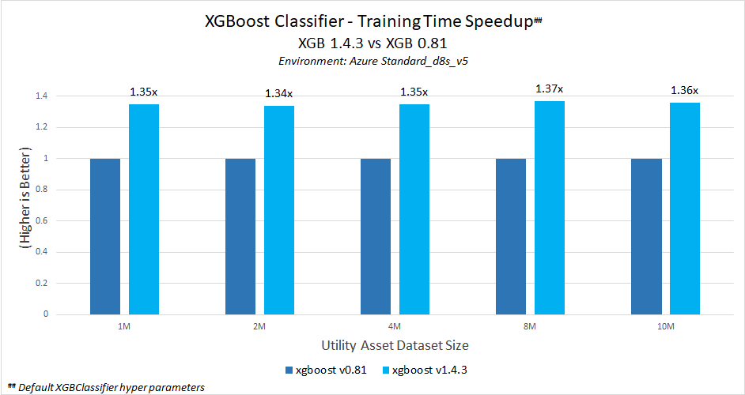
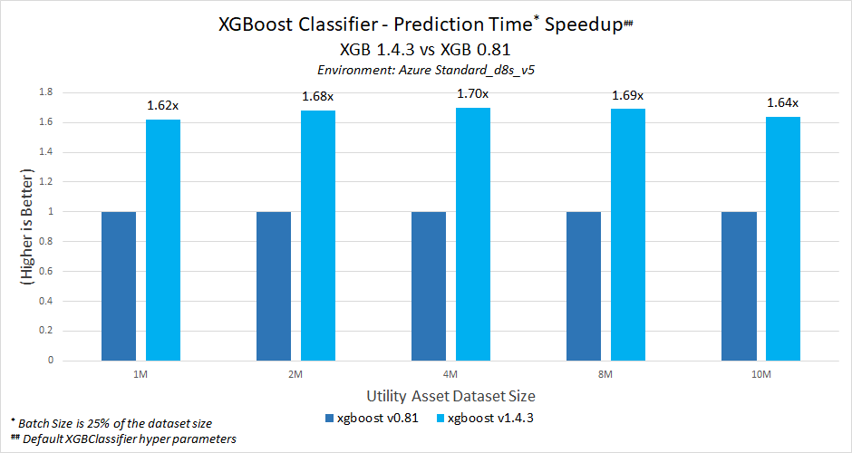
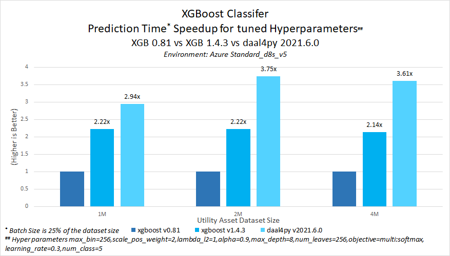

# **XGBoost Predictive Asset Maintenance**
Intel® oneAPI is used to achieve quick results even when the data for a model are huge. It provides the capability to reuse the code present in different languages so that the hardware utilization is optimized to provide these results.

| Platform                          | Microsoft Azure: Standard_D8s_v5 (IceLake)<br>Ubuntu 20.04
| :---                              | :---
| Hardware                          | Intel IceLake CPU
| Software                          | Intel® oneAPI AI Analytics Toolkit, xgboost, scikit-learn, pandas, daal4py
| What you will learn               | Intel® oneAPI performance advantage over the stock versions

# Contents
 - [Purpose](#purpose)
 - [Analysis on Intel® oneAPI XGBoost](#analysis-on-intel®-oneapi-xgboost)
    - [Framework Setup](#framework-setup)
    - [Activate conda environment](#activate-conda-environment)
    - [Run the code for test dataset generation, training the model and prediction](#run-the-code-for-test-dataset-generation-training-the-model-and-prediction)
    - [Observations](#observations)
 - [Analysis on XGBoost with oneDAL Python Wrapper (daal4py) model](#analysis-on-xgboost-with-onedal-python-wrapper-daal4py-model)
    - [Activate conda environment for stock version](#activate-conda-environment-1)
    - [Run the code to generate random data](#run-the-code-to-generate-random-data)
    - [Training the model and predicting the results for test data](#training-the-model-and-predicting-the-results-for-test-data)
    - [Observations](#observations-1)
 - [Appendix](#appendix)
    - [Generating the test dataset](#Generating-the-test-dataset)
    - [Running training and prediction with hyperparameter tuning](#Running-training-and-prediction-with-hyperparameter-tuning)

## Purpose
Predictive asset maintenance solutions of huge scale typically require operating across multiple hardware architectures. Accelerating training for the ever-increasing size of datasets and machine learning models is a major challenge while adopting AI. 

In this reference kit, we highlight the performance gain while using Intel® oneAPI AI Analytics Toolkit (oneAPI) over stock version of the same packages, especially for XGBoost. We generate datasets of given row size for a predictive asset maintenance analytics usecase and store it in ‘. pkl’ format; these data are then split for training and testing, where we train our model built on the XGBoost algorithm and predict test data. The time required to generate the data, train the model, convert the model, predict test data, and test accuracy of the predictions are captured for multiple runs on both the stock version and the oneAPI version of XGBoost. 

One of the important problem statement on this industrial scenario is to improve the MLOps time for developing and deploying new models due to its ever-increasing size of datasets over a period of time. XGBoost classifier with HIST tree method has been choosen to address this problem which will improve the overall training/tuning and validation time.

Industrial scenario for predictive asset maintenance, with huge set of batch processing, requires fast prediction time without accuracy lose. daal4py is suitable for this xgboost machine learning model to achive this criteria.

With Intel® enhancements in this machine learning model and daal4py framework, we do not need to go with higher cost MLOps environment as it provides huge gain even on the CPU based hardware.

This document covers three parts of analysis as given below.
- [Environment setup and analyse training time performance for Intel® oneAPI XGBoost](#analysis-on-intel®-oneapi-xgboost)
- [Environment setup and analyse XGBoost and DAAL model inferencing](#analysis-on-xgboost-with-daal-model)

## Key Implementation Details 
This sample code is implemented for CPU using the Python language.

### Packages

| **Package**                | **Stock Python**                | **Intel® Python**
| :---                       | :---                            | :---
| python                     | 3.9.12                          | 2022.0.0=py39_0
| pandas                     | 1.4.2                           | 1.2.5
| scikit-learn               | 1.0.2                           | 0.24.2, scikit-learn-intelex 2021.5.1
| xgboost                    | 0.81                            | 1.4.3
| daal4py                    | NA                              | 2021.6.0

> **Notes**
Intel has been working with XGBoost maintainers to optimize XGBoost with oneDAL optimizations **after xgb 0.81**. XGBoost versions above 1.x has the most optimizations, choosing the latest version available at the time of this experiment, **XBG 1.4.3**<br>
This experiment has been tested on the Intel distribution for scikit-learn 0.24.2 that is fully validated on the latest Intel extension sklearn 2021.5.1. However, Intel extension for scikit-learn is expected to run on versions >=0.24 but may or may not have been fully validated on the latest sklearn versions

### **Use Case E2E flow**


### Prerequistes
[Anaconda installation](https://docs.anaconda.com/anaconda/install/linux/)

## **Analysis on Intel® oneAPI XGBoost**
This codebase provides the framework for running the test dataset of various sizes using the Python data manipulation package Pandas. Also, it provides the framework for tuning the data model training with XGBoost hyperparameters for various datasize analysis.

### Framework Setup
The conda yaml dependencies are kept in the folder `./env/`.

| **YAML file**                 | **Configuration**
| :---                          | :--
| `env/stock/stock_python.yml`  | Stock Python=3.9.x environment setup with pandas, xgboost, scikit-learn packages
| `env/intel/intel_python.yml`  | Intel® oneAPI Python distribution

Conda environment setup for stock python distribution
```sh
conda env create -f env/stock/stock_python.yml
```
Conda environment setup for Intel® python distribution
```sh
conda env create -f env/intel/intel_python.yml
```

Environment setup for each distribution is required only once. This step does not cleanup the existing environment with the same name hence we need to make sure there is no conda environment exists with the same name. During this setup a new conda environment will be created with the dependencies listed in the YAML configuration.

#### Activate conda environment
Once the appropriate environment is created with the previous step then it has to be activated using the conda command as given below
```sh
conda activate <environment name>
```

#### Run the code for test dataset generation, training the model and prediction
> Before running the test, we need to ensure that the appropriate conda environment is activated.

The below bash script need to be executed to start creating the test dataset and training the model using pandas / modin.
```sh
bash ./run_dataset.sh
```

Below are the options which needs to be used for running the test execution.

> **Please Note:** Intel® Distribution of Modin package is not used as part of this benchmark analysis

| **Option** | **Values**
| :--        | :--
| Dataset Size | `25K to 10M`
| Hyperparameter tuning | `notuning` - Training without hyperparameter tuning<br>`hyperparametertuning` - Training with hyperparameter tuning
| XGBoost version | `stock` - Using Stock distribution v0.81<br>`intel` - Using Intel® XGBoost distribution v1.4.3
| Number of CPU cores | Based on the total number of cores available on the execution environment

> Note: Hyperparameter tuning option is not validated in this release

This stage invokes two python scripts to generate the test dataset with the chosen size and to train the model with selected data package library. The data generation process will create a folder with the name of the active conda environment wherein all the datset and the log files will be captured. The dataset file will be saved in pickle format and it will be reused in further test runs on this same environment for the same dataset size.

For the `Select xgboost distribution option`, select the name of the active conda environment.

Example option selection for Pandas with 1M dataset size as given below

```
        0. 25000
        1. 50000
        2. 100000
        3. 200000
        4. 400000
        5. 800000
        6. 1000000
        7. 2000000
        8. 4000000
        9. 8000000
        10. 10000000
Select dataset size: 6
        0. notuning
        1. hyperparametertuning
Select tuning option: 0
        0. stock
        1. intel
Select xgboost distribution option: 1
Number of CPU cores to be used for the training: 8
```

Log file will be generated in the below location, relative to the script folder.
```
./<environment-name>/logfile_<data-package-name>_<dataset-size>_timestamp.log
```
Test data pickle file will be generated in the below location, relative to the script folder.
```
./<environment-name>/data_<dataset-size>.pkl
```

> **NOTE:**<br>Dataset pickle file will be generated only once per environment.<br>Training script will be executed twice in case of `notuning` option in order to pickup the efficient time. It has been noticed sometimes the first execution may take little more time due to python runtime warmup.

Sample logfile which catures the training and prediction performance
```
+++++++++++++++++++++++++++++++++Iteration1++++++++++++++++++++++++++++++++++++++++++++++++++++
INFO:__main__:Reading the dataset from ./intel_xgboost_pandas/data_1000000.pkl...
INFO:__main__:=====> Time taken 28.960631132125854 secs for training and prediction for the data size of (1000000, 34)
INFO:__main__:=====> Training Time 27.993483781814575 secs
INFO:__main__:=====> Prediction Time 0.09821820259094238 secs
INFO:__main__:=====> XGBoost accuracy score 0.92238
INFO:__main__:DONE
+++++++++++++++++++++++++++++++++Iteration2++++++++++++++++++++++++++++++++++++++++++++++++++++
INFO:__main__:Reading the dataset from ./intel_xgboost_pandas/data_1000000.pkl...
INFO:__main__:=====> Time taken 28.985554695129395 secs for training and prediction for the data size of (1000000, 34)
INFO:__main__:=====> Training Time 28.034034729003906 secs
INFO:__main__:=====> Prediction Time 0.10062217712402344 secs
INFO:__main__:=====> XGBoost accuracy score 0.921812
INFO:__main__:DONE
+++++++++++++++++++++++++++++++++++++++++++++++++++++++++++++++++++++++++++++++++++++++++++++++
```

> Without using the bash script below mentioned scripts can also be used separately to perform the benchmarking

##### Generating the test dataset
Below python script may also be executed independently with the parameters provided below for generating the test dataset with the active environment.
```
usage: src/generate_data_pandas.py [-h] [-s SIZE] [-f FILE]

optional arguments:
  -h, --help            show this help message and exit
  -s SIZE, --size SIZE  data size which is number of rows
  -f FILE, --file FILE  output pkl file name
```

For example, below command should generate the dataset of 25k rows.
```
python src/generate_data_pandas.py -s 25000 -f dataset_25000.pkl
```
##### Running training and prediction
Below python script may also be executed independently with the parameters provided below for running the training and prediction along with hyperparameter turning.
```
usage: src/train_predict_pam.py [-h] [-f FILE] [-p PACKAGE] [-t TUNING] [-cv CROSS_VALIDATION] [-patch PATCH_SKLEARN]
                            -ncpu NUM_CPU

optional arguments:
  -h, --help            show this help message and exit
  -f FILE, --file FILE  input pkl file name
  -p PACKAGE, --package PACKAGE
                        data package to be used (pandas, modin)
  -t TUNING, --tuning TUNING
                        hyper parameter tuning (0/1)
  -cv CROSS_VALIDATION, --cross-validation CROSS_VALIDATION
                        cross validation iteration
  -patch PATCH_SKLEARN, --patch-sklearn PATCH_SKLEARN
                        sklearn patching with intel sklearnex (0/1)
  -ncpu NUM_CPU, --num-cpu NUM_CPU
                        Number of cpu cores: xgboost v0.81 does not use nthread as number of cores, hence need to
                        align that explicitly using this parameter
```
For example, below command should take the 25k dataset pkl file generated using the steps given in the above [section](#generating-the-test-dataset) and perform the training and prediction using XGBoost Classifier algorithm.
> NOTE: Assuming the execution environment is based on 8 core cpu hardware
```sh
python src/train_predict_pam.py -f dataset_25000.pkl -ncpu 8
```
In case of Intel® python conda environment the scikit-learn patch can be applied using the below additional parameter.
```sh
python src/train_predict_pam.py -f dataset_25000.pkl -ncpu 8 -patch 1
```

### Observations

#### XGBoost Comparison
This section analyzes the time to complete for the following tasks using the stock XGBoost algorithm: training, and prediction. Total two runs per task and the average of that have been considered here. All the tests are conducted on Azure Standard_D8s_v5 (Icelake) environment. Additionally, the accuracy for each run of prediction model is shown. The first datapoint is for the smallest data size of 25,000, increasing to the largest data size of 10,000,000. The data size progression goes as follows: 25k -> ... -> 10M.

Default Hyperparameters used for Stock xgboost

        'base_score': 0.5, 
        'booster': 'gbtree', 
        'colsample_bylevel': 1, 
        'colsample_bytree': 1, 
        'gamma': 0, 
        'learning_rate': 0.1, 
        'max_delta_step': 0, 
        'max_depth': 3, 
        'min_child_weight': 1, 
        'missing': None, 
        'n_estimators': 100, 
        'nthread’: 8, 
        'objective': 'binary:logistic', 
        'reg_alpha': 0, 
        'reg_lambda': 1, 
        'scale_pos_weight': 1.5, 
        'seed': 0, 
        'silent': 1, 
        'subsample': 1, 
        'use_label_encoder': False, 
        'eval_metric': 'logloss'

Default Hyperparameters used for Intel optimized xgboost

        'objective': 'binary:logistic', 
        'base_score': 0.5, 
        'booster': 'gbtree', 
        'colsample_bylevel': 1, 
        'colsample_bynode': 1, 
        'colsample_bytree': 1, 
        'gamma': 0, 
        'gpu_id': -1, 
        'learning_rate': 0.300000012, 
        'max_delta_step': 0, 
        'max_depth': 6, 
        'min_child_weight': 1, 
        'monotone_constraints': '()', 
        'n_jobs': 8, 
        'num_parallel_tree': 1, 
        'random_state': 0, 
        'reg_alpha': 0, 
        'reg_lambda': 1, 
        'scale_pos_weight': 1.51, 
        'subsample': 1, 
        'tree_method': 'exact', 
        'validate_parameters': 1, 
        'verbosity': None, 
        'eval_metric': 'logloss'


<br>**Key Takeaway**<br>Intel optimizations available in XGBoost 1.4.3 offers training time speed-up is nearly 1.37x compared to stock XGBoost 0.81 with default hyperparameters on this dataset


<br>**Key Takeaway**<br>Intel optimizations available in XGBoost 1.4.3 offers prediction  time speed-up ranging between 1.62x and 1.70x  compared to stock XGBoost 0.81 with default hyperparameters on this dataset

## **Analysis on XGBoost with oneDAL Python Wrapper (daal4py) model**
In order to gain even further improved performance on prediction time for the xgboost trained machine learning model, it can be converted to a daal4py model. daal4py makes xgboost machine learning algorithm execution faster to gain better performance on the underlying hardware by utilizing the Intel® oneAPI Data Analytics Library (oneDAL).

Below are the training parameters used on the base xgboost trained model, for this evaluation

      'max_bin': 256,
      'scale_pos_weight': 2,
      'lambda_l2': 1,
      'alpha': 0.9,
      'max_depth': 8,
      'num_leaves': 2**8,
      'verbosity': 0,
      'objective': 'multi:softmax',
      'learning_rate': 0.3,
      'num_class': 5,

### Activate conda environment
Use the following command to activate the python distribution environment that was created:

```
conda activate (env_name)
```

### Run the code to generate random data
Run the following command to generate the dataset with the given row size
```
python src/generate_data_pandas.py -s 25000
```
Note: -s defines the data size. In this example we are choosing 25,000 but you can input a different data size as well. Runtimes will vary as data size increases or decreases.

> NOTE: A file with '.pkl' extension would have been generated with the name `asset_data.pkl` which can be used in further steps for training and prediction.

### Training the model and predicting the results for test data
A file with '.pkl' extension generated goes as the input for this Python file. Make sure the file 'daal-xgb_model.py' is present in the working directory.
```
usage: daal_xgb_model.py [-h] [-f FILE] [-stock STOCK_XGB]

optional arguments:
  -h, --help            show this help message and exit
  -f FILE, --file FILE  input pkl file name
  -stock STOCK_XGB, --stock-xgb STOCK_XGB
                        use 1 for stock environment
```
> NOTE: For stock environment (-stock 1), only xgboost prediction has been performed for benchmark against daal4py model converted from intel xgboost.

Run the following command to train the model with the given dataset and convert the same to daal4py format and measure the prediction time performance.
```sh
python3 src/daal_xgb_model.py -f <pickle-file>
```

Sample output
```
INFO:__main__:Reading the dataset from intel-python/data_10000000.pkl...
INFO:__main__:XGBoost training time (seconds): 1208.274390
INFO:__main__:XGBoost inference time (seconds): 2.422618
INFO:__main__:DAAL conversion time (seconds): 0.738738
INFO:__main__:DAAL inference time (seconds): 0.982114
INFO:__main__:XGBoost accuracy: 0.922012
INFO:__main__:Daal4py accuracy: 0.922012
INFO:__main__:daal4py time improvement relative to XGBoost: 0.594606
INFO:__main__:Accuracy Difference 0.000000
```

### Observations


<br>**Key Takeaways**
- Intel optimizations available in XGBoost 1.4.3 offers prediction time speed-up ranging between 2.14x and 2.22x  compared to stock XGBoost 0.81 with XGBoost model trained with tuned hyperparameters on this dataset
- Intel optimizations available in daal4py offers additional  prediction time speed-up, overall ranging between 2.94x to 3.75x compared to stock XGBoost 0.81 with XGBoost model trained with tuned hyperparameters on this dataset

> No accuracy drop observed with the daal4py prediction

### Conclusion
Predictive asset maintenance solutions of huge scale typically require acceleration in training and prediction for the ever-increasing size of datasets without changing the existing computing resources in order to make their solutions feasible and economically attractive for Utility customers. This reference kit implementation provides performance-optimized guide around utility asset maintenance use cases that can be easily scaled across similar use cases.